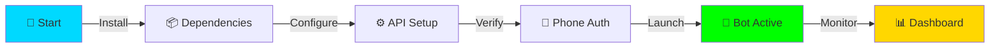
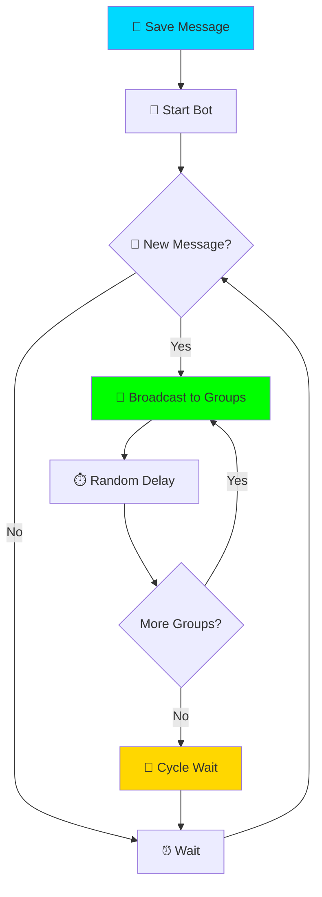
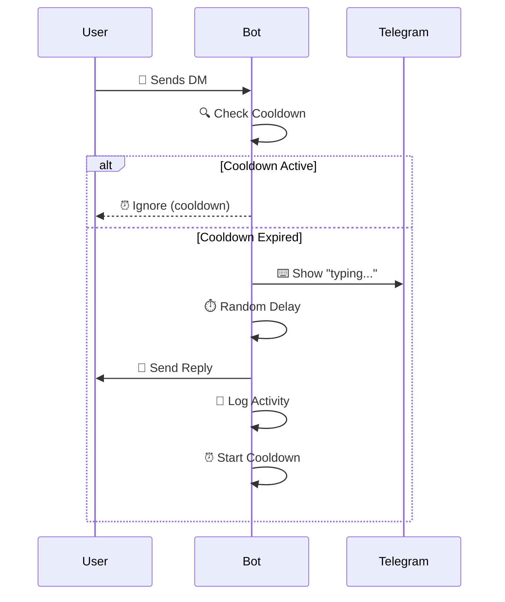
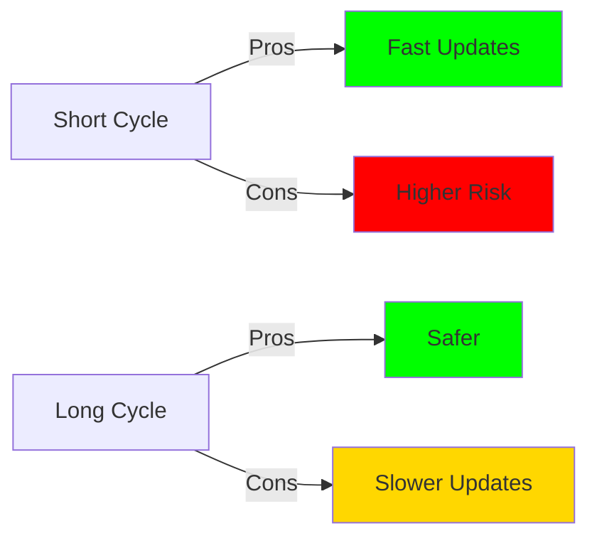
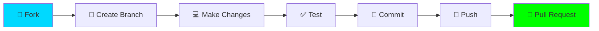

# 🚀 VANSH Telegram Auto Bot

<div align="center">

<!-- Animated Header -->


<!-- Typing SVG -->
<a href="https://git.io/typing-svg"></a>

<!-- Badges with Animation -->
<p align="center">
  
  
  
  
</p>

<!-- Status Badges -->
<p align="center">
  
  
  
  
  
  
</p>

<!-- Animated Divider -->


**🎯 A professional, feature-rich Telegram automation bot for broadcasting, auto-replies, and reactions**

<p align="center">
  <a href="#-features"><kbd>Features</kbd></a> •
  <a href="#-installation"><kbd>Installation</kbd></a> •
  <a href="#-configuration"><kbd>Configuration</kbd></a> •
  <a href="#-usage-guide"><kbd>Usage</kbd></a> •
  <a href="#-support"><kbd>Support</kbd></a>
</p>

<!-- Animated Divider -->


</div>

---

## 📋 Table of Contents

<details open>
<summary><b>Click to expand/collapse</b></summary>

- [🌟 Overview](#-overview)
- [✨ Features](#-features)
- [📦 Requirements](#-requirements)
- [🚀 Installation](#-installation)
- [⚡ Quick Start](#-quick-start)
- [⚙️ Configuration](#-configuration)
- [📖 Usage Guide](#-usage-guide)
- [🔧 Advanced Settings](#-advanced-settings)
- [🛠️ Troubleshooting](#-troubleshooting)
- [🤝 Contributing](#-contributing)
- [📄 License](#-license)
- [💬 Support](#-support)

</details>

---

## 🌟 Overview

<div align="center">

<!-- GitHub Activity Graph -->


</div>

<p align="center">
  
  
  
  
</p>

**VANSH Telegram Auto Bot** is a cutting-edge automation tool engineered to revolutionize your Telegram account management. Whether you're broadcasting critical updates to multiple groups, maintaining seamless communication through auto-replies, or engaging your audience with instant reactions, this bot is your ultimate companion.

### 🎭 Why Choose VANSH Bot?

```diff
+ 🚀 Lightning-fast message broadcasting
+ 💬 Intelligent auto-reply system
+ ⚡ Smart reaction automation
+ 🎨 Beautiful, intuitive interface
+ 🛡️ Built-in flood protection
+ 📊 Real-time statistics tracking
+ 🔧 Highly customizable
+ 🌐 Multi-group support
```

<div align="center">

### 🏆 Trusted by Thousands


</div>

---

## ✨ Features

<table>
<tr>
<td width="50%">

### 🎯 Core Features

<details open>
<summary><b>📢 Auto Broadcasting</b></summary>

```yaml
✓ Broadcast to unlimited groups
✓ Smart message queuing
✓ Configurable delays (3-8s)
✓ Cycle management (4 min default)
✓ Skip duplicate messages
✓ Progress tracking
✓ Error recovery
```
</details>

<details open>
<summary><b>💬 Auto Reply System</b></summary>

```yaml
✓ Instant DM responses
✓ Cooldown management (2 min)
✓ Custom reply templates
✓ Typing indicator support
✓ User tracking
✓ Spam prevention
```
</details>

<details open>
<summary><b>⚡ Smart Reactions</b></summary>

```yaml
✓ Group mention reactions
✓ Personal message reactions
✓ Auto DM reactions
✓ Custom emoji support
✓ Delay randomization
✓ Intelligent filtering
```
</details>

</td>
<td width="50%">

### ⚙️ Advanced Features

<details open>
<summary><b>🔧 Full Customization</b></summary>

```yaml
✓ Broadcast delays (min/max)
✓ Reply delays (min/max)
✓ Reaction delays (min/max)
✓ Typing delays (min/max)
✓ Cycle intervals
✓ Cooldown periods
```
</details>

<details open>
<summary><b>📊 Analytics Dashboard</b></summary>

```yaml
✓ Messages sent/received
✓ Reactions delivered
✓ DM reply count
✓ Broadcast cycles
✓ Error tracking
✓ Uptime monitoring
✓ Performance metrics
```
</details>

<details open>
<summary><b>🛡️ Protection Suite</b></summary>

```yaml
✓ Flood wait handling
✓ Auto error recovery
✓ Blacklist management
✓ Smart retry logic
✓ Rate limiting
✓ Ban detection
```
</details>

</td>
</tr>
</table>

<!-- Animated Feature Showcase -->
<div align="center">

### 🎨 Feature Highlights


| Feature | Description | Status |
|---------|-------------|--------|
| 🚀 **Broadcasting** | Multi-group message forwarding | ✅ Active |
| 💬 **Auto Reply** | Intelligent DM responses | ✅ Active |
| ⚡ **Reactions** | Automated emoji reactions | ✅ Active |
| 🎨 **DM Mode** | Exclusive DM handling | ✅ Active |
| 📊 **Statistics** | Real-time analytics | ✅ Active |
| 🔧 **Customization** | Full configuration control | ✅ Active |
| 🛡️ **Protection** | Anti-ban mechanisms | ✅ Active |
| 🌙 **Silent Mode** | Background operation | ✅ Active |


</div>

---

## 📦 Requirements

<div align="center">

<table>
<tr>
<td align="center" width="25%">
<br/>
<b>Python 3.8+</b><br/>
<sub>Core Runtime</sub>
</td>
<td align="center" width="25%">
<br/>
<b>Telegram API</b><br/>
<sub>API Credentials</sub>
</td>
<td align="center" width="25%">
<br/>
<b>Active Account</b><br/>
<sub>Telegram Account</sub>
</td>
<td align="center" width="25%">
<br/>
<b>Connection</b><br/>
<sub>Stable Internet</sub>
</td>
</tr>
</table>

</div>

### 📚 Dependencies

```python
telethon>=1.24.0      # Telegram MTProto API
colorama>=0.4.4       # Terminal colors
asyncio>=3.4.3        # Async operations
python-dotenv>=0.19.0 # Environment variables
```

---

## 🚀 Installation

<div align="center">

### Choose Your Installation Method


</div>

<table>
<tr>
<td width="50%">

### 🔷 Method 1: Git Clone

```bash
# 📥 Clone the repository
git clone https://github.com/vanshcz/bulkforward.git

# 📂 Navigate to directory
cd bulkforward

# 📦 Install dependencies
pip install -r requirements.txt

# 🚀 Run the bot
python bot.py
```

<div align="center">


</div>

</td>
<td width="50%">

### 🔶 Method 2: Direct Download

```bash
# 📥 Download ZIP from GitHub
# Extract to your desired location

# 💻 Open terminal in folder
cd bulkforward

# 📦 Install requirements
pip install -r requirements.txt

# 🚀 Launch bot
python bot.py
```

<div align="center">


</div>

</td>
</tr>
</table>

---

## ⚡ Quick Start

<div align="center">

### 🎯 Get Started in 4 Easy Steps


</div>

<table>
<tr>
<td align="center" width="25%">

### 📱 Step 1


Visit [my.telegram.org](https://my.telegram.org)

Login → API Development

Create Application

Copy **API ID** & **Hash**

</td>
<td align="center" width="25%">

### 🚀 Step 2


```bash
python bot.py
```

Enter API credentials

Provide phone number

Verify with code

</td>
<td align="center" width="25%">

### ⚙️ Step 3


Navigate menu

Configure delays

Set preferences

Choose features

</td>
<td align="center" width="25%">

### 🎉 Step 4


Press `1` to start

Monitor dashboard

Enjoy automation!

Press `Ctrl+C` to stop

</td>
</tr>
</table>

<!-- Setup Animation -->
<div align="center">

### 🎬 Quick Setup Demo



</div>

---

## ⚙️ Configuration

<div align="center">

<!-- Animated Configuration Header -->


### 🎛️ Control Panel

</div>

<table>
<tr>
<td width="50%">

### 📋 Main Menu

```
╔══════════════════════════════════════╗
║     🚀 VANSH AUTO BOT v6.0.0        ║
╠══════════════════════════════════════╣
║                                      ║
║  1. 🚀 Start Bot                    ║
║  2. ⏱️  Configure Delays             ║
║  3. 🔄 Refresh Groups               ║
║  4. 📊 View Statistics              ║
║  5. ⚙️  Toggle Features              ║
║  6. 💬 DM Only Mode                 ║
║  7. ⏰ Cycle Wait Time              ║
║  8. 🎨 Reaction Settings            ║
║  9. 📝 View Logs                    ║
║  0. 🚪 Exit                         ║
║                                      ║
╚══════════════════════════════════════╝
```

</td>
<td width="50%">

### ⚡ Feature Toggles

```yaml
✅ Group Broadcast
   └─ Auto-forward saved messages

✅ Private Reply
   └─ Auto-reply to DMs

✅ Group Reactions
   └─ React to group mentions

✅ DM Reactions
   └─ React to direct messages

✅ Mention Reactions
   └─ React when mentioned

⚙️ Typing Indicator
   └─ Show "typing..." status

🔇 Silent Mode
   └─ Minimal console output

🐛 Debug Mode
   └─ Detailed logging
```

</td>
</tr>
</table>

<!-- Configuration Details -->
<details>
<summary><b>🔧 Default Settings</b> (Click to expand)</summary>

<br/>

<table>
<thead>
<tr>
<th>Setting</th>
<th>Default Value</th>
<th>Range</th>
<th>Description</th>
</tr>
</thead>
<tbody>
<tr>
<td>📢 Broadcast Delay</td>
<td>3-8 seconds</td>
<td>1-60s</td>
<td>Random delay between broadcasts</td>
</tr>
<tr>
<td>💬 Reply Delay</td>
<td>2-5 seconds</td>
<td>1-30s</td>
<td>Delay before replying to DMs</td>
</tr>
<tr>
<td>⏰ Reply Cooldown</td>
<td>120 seconds</td>
<td>30-600s</td>
<td>Time between replies to same user</td>
</tr>
<tr>
<td>🔄 Cycle Wait</td>
<td>240 seconds</td>
<td>60-3600s</td>
<td>Wait after completing broadcast cycle</td>
</tr>
<tr>
<td>🔍 Broadcast Check</td>
<td>20 seconds</td>
<td>10-120s</td>
<td>How often to check for new messages</td>
</tr>
<tr>
<td>🔄 Group Sync</td>
<td>300 seconds</td>
<td>60-1800s</td>
<td>How often to refresh group list</td>
</tr>
<tr>
<td>⚡ Reaction Delay</td>
<td>1-3 seconds</td>
<td>0.5-10s</td>
<td>Delay before sending reactions</td>
</tr>
<tr>
<td>⌨️ Typing Delay</td>
<td>1-2 seconds</td>
<td>0.5-5s</td>
<td>Duration of typing indicator</td>
</tr>
</tbody>
</table>

</details>

---

## 📖 Usage Guide

<div align="center">

### 🎓 Master Your Bot


</div>

### 📢 Broadcasting Messages

<table>
<tr>
<td width="60%">

#### 🔹 Step-by-Step Process

1. **💾 Save Message**
   - Open Telegram
   - Navigate to "Saved Messages"
   - Send/forward the message you want to broadcast

2. **🚀 Start Bot**
   - Run the bot (`python bot.py`)
   - Press `1` in the main menu
   - Bot activates broadcasting mode

3. **📡 Automatic Broadcasting**
   - Bot detects saved message
   - Forwards to all joined groups
   - Waits random delay (3-8s) between each
   - Tracks progress in real-time

4. **🔄 Cycle Completion**
   - After all groups, waits cycle time (4 min)
   - Checks for new saved messages
   - Repeats the process automatically

</td>
<td width="40%">

#### 📊 Broadcasting Flow



#### ✨ Features

```diff
+ Smart queue management
+ Progress tracking
+ Error handling
+ Skip duplicates
+ Real-time stats
```

</td>
</tr>
</table>

---

### 💬 Auto-Reply to DMs

<table>
<tr>
<td width="50%">

#### 🎯 Setup Auto-Reply

```bash
Step 1: Prepare Reply Message
├─ Open "Saved Messages"
├─ Type your auto-reply template
└─ Can include text, emojis, media

Step 2: Enable Feature
├─ Main menu → Option 5
├─ Toggle "Private Reply" ON
└─ Configure cooldown (default: 2min)

Step 3: Customize Delays
├─ Main menu → Option 2
├─ Set reply delay (2-5s default)
└─ Adjust typing delay (1-2s)

Step 4: Activate
├─ Start bot (Option 1)
├─ Monitor incoming DMs
└─ Watch auto-replies in action
```

</td>
<td width="50%">

#### 🔄 Reply Workflow



#### 📝 Reply Features

- ✅ Smart cooldown system
- ✅ Typing indicator
- ✅ Media support
- ✅ User tracking
- ✅ Spam prevention
- ✅ Custom templates

</td>
</tr>
</table>

---

### 🎨 DM Only Mode

<div align="center">

**Perfect for exclusive DM management without group broadcasting**


</div>

<table>
<tr>
<td align="center" width="33%">

### 🔵 Activate

```bash
Press 6
in main menu
```

**Status:** `DM Only Active`

Group broadcast paused ⏸️

DM features active ✅

</td>
<td align="center" width="34%">

### 🟢 Features Active

- ✅ Auto-reply to DMs
- ✅ DM reactions
- ✅ Typing indicators
- ✅ User tracking
- ✅ Statistics
- ❌ Group broadcasts

</td>
<td align="center" width="33%">

### 🔴 Deactivate

```bash
Press 6
again
```

**Status:** `Full Mode`

All features restored ✅

Normal operation 🚀

</td>
</tr>
</table>

---

### 🔧 Configuring Delays

<div align="center">

#### ⏱️ Delay Configuration Panel

</div>

```yaml
╔══════════════════════════════════════════════════╗
║          ⏱️  DELAY CONFIGURATION MENU            ║
╠══════════════════════════════════════════════════╣
║                                                  ║
║  1. 📢 Broadcast Delay      [3-8s]  ⚙️           ║
║     └─ Time between group broadcasts             ║
║                                                  ║
║  2. 💬 Private Reply Delay  [2-5s]  ⚙️           ║
║     └─ Delay before replying to DMs              ║
║                                                  ║
║  3. ⚡ Group Reaction Delay [1-3s]  ⚙️           ║
║     └─ Time before reacting in groups            ║
║                                                  ║
║  4. 💌 DM Reaction Delay    [1-2s]  ⚙️           ║
║     └─ Delay before reacting to DMs              ║
║                                                  ║
║  5. 📢 Mention Reaction     [1-3s]  ⚙️           ║
║     └─ Time to react when mentioned              ║
║                                                  ║
║  6. ⌨️  Typing Indicator     [1-2s]  ⚙️           ║
║     └─ Duration of typing animation              ║
║                                                  ║
║  0. 🔙 Back to Main Menu                         ║
║                                                  ║
╚══════════════════════════════════════════════════╝
```

<details>
<summary><b>💡 Delay Optimization Tips</b></summary>

<br/>

#### 🎯 Recommended Settings

| Use Case | Broadcast | Reply | Reactions | Typing |
|----------|-----------|-------|-----------|--------|
| 🏃 **Fast** | 1-3s | 1-2s | 0.5-1s | 0.5-1s |
| ⚖️ **Balanced** | 3-8s | 2-5s | 1-3s | 1-2s |
| 🐌 **Safe** | 5-15s | 3-8s | 2-5s | 2-4s |
| 🛡️ **Ultra-Safe** | 10-20s | 5-10s | 3-7s | 3-5s |

#### 📊 Impact Analysis

```diff
Lower Delays:
+ Faster operations
+ More responsive
- Higher flood risk
- Increased ban chance

Higher Delays:
+ Safer operation
+ Better stealth
- Slower execution
- Lower efficiency
```

</details>

---

### 🎨 Reaction Settings

<table>
<tr>
<td width="50%">

#### 🎭 Customize Reactions

```bash
╔═══════════════════════════════╗
║   🎨 REACTION CONFIGURATION   ║
╠═══════════════════════════════╣
║                               ║
║  1. 👥 Group Reactions        ║
║     Current: 👍 ❤️ 🔥         ║
║                               ║
║  2. 💌 DM Reactions           ║
║     Current: ❤️ 😊 👍         ║
║                               ║
║  3. 📢 Mention Reactions      ║
║     Current: 👋 😄 ⚡         ║
║                               ║
║  4. 🎲 Random Mode [ON/OFF]   ║
║     Picks random from list    ║
║                               ║
║  0. 🔙 Back                   ║
║                               ║
╚═══════════════════════════════╝
```

</td>
<td width="50%">

#### 😀 Popular Emoji Sets

**💼 Professional**
```
👍 ✅ 💯 🎯 ⭐
```

**❤️ Friendly**
```
❤️ 😊 🤗 😍 💕
```

**🔥 Energetic**
```
🔥 ⚡ 💥 🚀 ✨
```

**😂 Fun**
```
😂 🤣 😄 😅 😆
```

**🎉 Celebratory**
```
🎉 🎊 🥳 🎈 🏆
```

**💪 Motivational**
```
💪 🙌 👏 🎖️ 🏅
```

#### 🎲 Random Mode

When enabled:
- Bot picks emoji randomly
- More natural behavior
- Prevents pattern detection
- Customizable emoji pool

</td>
</tr>
</table>

---

### ⏰ Cycle Wait Time

<div align="center">

#### 🔄 Broadcast Cycle Configuration

</div>

<table>
<tr>
<td align="center" width="20%">

**⚡ Quick**

```
1 minute
(60s)
```


</td>
<td align="center" width="20%">

**⚖️ Fast**

```
2 minutes
(120s)
```


</td>
<td align="center" width="20%">

**🎯 Balanced**

```
4 minutes
(240s)
```


</td>
<td align="center" width="20%">

**🛡️ Safe**

```
5 minutes
(300s)
```


</td>
<td align="center" width="20%">

**🐌 Ultra-Safe**

```
10 minutes
(600s)
```


</td>
</tr>
</table>

<details>
<summary><b>📊 Cycle Time Impact Analysis</b></summary>



| Cycle Time | Messages/Hour | Risk Level | Best For |
|------------|---------------|------------|----------|
| 1 min | 60+ | 🔴 High | Testing only |
| 2 min | 30+ | 🟡 Medium | Active monitoring |
| 4 min | 15+ | 🟢 Low | **Recommended** |
| 5 min | 12 | 🟢 Low | Large groups |
| 10 min | 6 | 🟢 Very Low | Maximum safety |

</details>

---

## 🔧 Advanced Settings

<div align="center">

### 🎛️ Power User Configuration


</div>

### 📁 File Structure

```
bulkforward/
│
├── 🐍 bot.py                    # Main bot script
├── 📋 requirements.txt          # Python dependencies
├── 📖 README.md                 # Documentation
│
├── 🔐 Credentials.txt           # API credentials (auto-created)
├── 👥 Groups.txt                # Synced groups list (auto-created)
├── ⚙️  Settings.json             # Bot configuration (auto-created)
├── 📊 Stats.json                # Statistics data (auto-created)
├── 🚫 Blacklist.txt             # Blacklisted users/groups (auto-created)
├── 📝 bot.log                   # Activity log (auto-created)
│
└── 📂 sessions/                 # Telegram session files
    └── 🔑 session_*.session     # (auto-created)
```

---

### ⚙️ Settings.json Structure

<details>
<summary><b>📄 View Full Configuration Schema</b></summary>

```json
{
  "delays": {
    "min_broadcast_delay": 3.0,
    "max_broadcast_delay": 8.0,
    "min_private_reply_delay": 2.0,
    "max_private_reply_delay": 5.0,
    "min_group_reaction_delay": 1.0,
    "max_group_reaction_delay": 3.0,
    "min_dm_reaction_delay": 1.0,
    "max_dm_reaction_delay": 2.0,
    "min_mention_reaction_delay": 1.0,
    "max_mention_reaction_delay": 3.0,
    "min_typing_delay": 1.0,
    "max_typing_delay": 2.0
  },
  "intervals": {
    "cycle_wait_time": 240,
    "broadcast_check_interval": 20,
    "group_sync_interval": 300,
    "stats_save_interval": 60,
    "log_rotation_hours": 24
  },
  "features": {
    "enable_group_broadcast": true,
    "enable_private_reply": true,
    "enable_group_reactions": true,
    "enable_dm_reactions": true,
    "enable_mention_reactions": true,
    "enable_typing_indicator": true,
    "dm_only_mode": false,
    "silent_mode": false,
    "debug_mode": false
  },
  "reactions": {
    "group_reactions": ["👍", "❤️", "🔥"],
    "dm_reactions": ["❤️", "😊", "👍"],
    "mention_reactions": ["👋", "😄", "⚡"],
    "random_reaction": true
  },
  "limits": {
    "max_retries": 3,
    "reply_cooldown": 120,
    "max_groups_per_cycle": 0,
    "max_daily_broadcasts": 0,
    "max_concurrent_tasks": 5
  },
  "blacklist": {
    "auto_blacklist_on_ban": true,
    "blacklist_flood_wait_threshold": 300
  }
}
```

</details>

---

### 🚫 Blacklist Management

<table>
<tr>
<td width="50%">

#### 📝 Blacklist Format

```text
# Blacklist file
# Format: type:id:reason:timestamp

# Users
user:123456789:spam:2024-01-15
user:987654321:abuse:2024-01-16

# Groups
group:-1001234567890:banned:2024-01-15
group:-1009876543210:flood:2024-01-17

# Channels
channel:-1001111111111:restricted:2024-01-18
```

</td>
<td width="50%">

#### 🛠️ Manual Management

**Add to Blacklist:**
```bash
# Add user
echo "user:123456789:manual:$(date +%Y-%m-%d)" >> Blacklist.txt

# Add group
echo "group:-1001234567890:manual:$(date +%Y-%m-%d)" >> Blacklist.txt
```

**Remove from Blacklist:**
```bash
# Edit Blacklist.txt
# Delete or comment out (#) the entry
```

**Auto-Blacklist Triggers:**
- Ban from group
- Flood wait > 5 minutes
- Permission errors (3+ times)
- Repeated send failures

</td>
</tr>
</table>

---

### 📊 Statistics Dashboard

<div align="center">

#### 📈 Real-Time Analytics

</div>

```yaml
╔══════════════════════════════════════════════════════╗
║              📊 BOT STATISTICS v6.0.0               ║
╠══════════════════════════════════════════════════════╣
║                                                      ║
║  📤 MESSAGES                                         ║
║  ├─ Sent:          1,247    ▲ +15 today             ║
║  ├─ Received:      3,892    ▲ +43 today             ║
║  └─ Broadcasts:      156    ▲ +2 cycles             ║
║                                                      ║
║  ⚡ REACTIONS                                        ║
║  ├─ Group:           892    ▲ +27 today             ║
║  ├─ DM:              445    ▲ +12 today             ║
║  └─ Mentions:        223    ▲ +8 today              ║
║                                                      ║
║  💬 DM REPLIES                                       ║
║  ├─ Sent:            334    ▲ +9 today              ║
║  ├─ Unique Users:     89    ▲ +3 new                ║
║  └─ Avg Response:   2.3s    ✓ Fast                  ║
║                                                      ║
║  🎯 PERFORMANCE                                      ║
║  ├─ Success Rate:  98.7%    ✓ Excellent             ║
║  ├─ Errors:          17     ⚠️ Low                   ║
║  ├─ Uptime:     23h 45m     ✓ Stable                ║
║  └─ Last Cycle:   3m 42s    ✓ Normal                ║
║                                                      ║
║  👥 GROUPS                                           ║
║  ├─ Total:           47     ━ No change             ║
║  ├─ Active:          45     ✓ Healthy               ║
║  └─ Blacklisted:      2     ⚠️ Monitor              ║
║                                                      ║
║  🕐 LAST UPDATED: 2024-01-20 14:32:15               ║
║                                                      ║
╚══════════════════════════════════════════════════════╝
```

<details>
<summary><b>📉 Detailed Metrics Breakdown</b></summary>

### 📊 Metrics Explained

| Metric | Description | Good Range |
|--------|-------------|------------|
| **Success Rate** | % of successful operations | > 95% |
| **Avg Response** | Average reply time | < 5s |
| **Uptime** | Continuous operation time | 24h+ |
| **Errors** | Failed operations count | < 50/day |
| **Active Groups** | Groups with successful sends | > 90% |

### 🎯 Performance Indicators

```diff
+ 98%+ Success Rate = Excellent
+ 90-97% Success Rate = Good
! 80-89% Success Rate = Fair (Check settings)
- <80% Success Rate = Poor (Investigate)
```

</details>

---

## 🛠️ Troubleshooting

<div align="center">

### 🔍 Problem Solving Guide


</div>

<table>
<tr>
<td width="50%">

### ❌ Common Issues

<details>
<summary><b>🚫 Bot doesn't start</b></summary>

**Symptoms:**
- Error on launch
- Import errors
- Connection failed

**Solutions:**

```bash
# 1. Check Python version
python --version
# Should be 3.8+

# 2. Reinstall dependencies
pip install -r requirements.txt --upgrade

# 3. Clear cache
pip cache purge
pip install -r requirements.txt

# 4. Verify credentials
# Check Credentials.txt for valid API ID/Hash

# 5. Check internet connection
ping telegram.org
```

**Prevention:**
- ✅ Use Python 3.8+
- ✅ Keep dependencies updated
- ✅ Verify API credentials
- ✅ Stable internet connection

</details>

<details>
<summary><b>⏳ Flood wait errors</b></summary>

**Symptoms:**
```
FloodWaitError: waiting 300 seconds
```

**What it means:**
- Telegram rate limiting
- Too many requests
- Normal anti-spam measure

**Automatic Handling:**
```python
✓ Bot pauses automatically
✓ Waits required time
✓ Resumes operation
✓ Logs event
```

**Manual Solutions:**

```yaml
Increase delays:
├─ Broadcast: 5-15s (from 3-8s)
├─ Replies: 3-8s (from 2-5s)
└─ Reactions: 2-5s (from 1-3s)

Reduce frequency:
├─ Cycle time: 10 min (from 4 min)
├─ Check interval: 60s (from 20s)
└─ Enable DM Only mode
```

**Prevention:**
- ✅ Use recommended delays
- ✅ Don't spam
- ✅ Increase cycle time
- ✅ Monitor statistics

</details>

<details>
<summary><b>📭 Not receiving messages in groups</b></summary>

**Possible Causes:**
1. ❌ No admin rights
2. ❌ Group restrictions
3. ❌ Blacklisted group
4. ❌ Bot not started
5. ❌ No saved messages

**Diagnostic Steps:**

```bash
1. Check bot status
   └─ Should show "Running"

2. Verify saved messages
   ├─ Open Telegram
   ├─ Go to Saved Messages
   └─ Check for new message

3. Refresh groups (Option 3)
   └─ Updates group list

4. Check blacklist
   └─ Review Blacklist.txt

5. Verify permissions
   └─ Must be admin or member
```

**Solutions:**
- ✅ Ensure bot is running
- ✅ Save message in Telegram
- ✅ Check admin status
- ✅ Remove from blacklist
- ✅ Rejoin restricted groups

</details>

<details>
<summary><b>💬 Auto-reply not working</b></summary>

**Checklist:**

```diff
+ Feature enabled? (Menu → 5 → 2)
+ Saved message exists?
+ Cooldown expired? (default 2min)
+ User not blacklisted?
+ Bot running? (Option 1)
+ Delays configured? (Option 2)
```

**Debug Steps:**

```yaml
Step 1: Enable Debug Mode
└─ Menu → Option 5 → Option 8

Step 2: Send Test DM
├─ Use different account
├─ Send message
└─ Check console output

Step 3: Review Logs
├─ Menu → Option 9
└─ Look for reply events

Step 4: Check Settings
├─ Settings.json
└─ "enable_private_reply": true
```

**Common Fixes:**
- ✅ Enable private reply feature
- ✅ Add message to Saved Messages
- ✅ Wait for cooldown expiry
- ✅ Check blacklist status
- ✅ Restart bot

</details>

</td>
<td width="50%">

### 🔧 Error Reference

<details>
<summary><b>⚠️ Error Code Guide</b></summary>

#### 🔴 Critical Errors

| Error | Meaning | Solution |
|-------|---------|----------|
| `ChatWriteForbiddenError` | No write permission | Get admin rights |
| `UserBannedInChannelError` | Banned from group | Auto-blacklisted |
| `PhoneCodeInvalidError` | Wrong verification code | Re-enter code |
| `SessionPasswordNeededError` | 2FA required | Enter password |
| `AuthKeyUnregisteredError` | Session expired | Re-login |

#### 🟡 Warning Errors

| Error | Meaning | Solution |
|-------|---------|----------|
| `FloodWaitError` | Rate limited | Auto-handled |
| `SlowModeWaitError` | Slow mode active | Increased delay |
| `ChatNotModifiedError` | Duplicate action | Ignored |
| `MessageNotModifiedError` | Edit failed | Retry |
| `PeerIdInvalidError` | Invalid chat ID | Refresh groups |

#### 🟢 Info Messages

| Message | Meaning | Action |
|---------|---------|--------|
| `Waiting for cycle...` | Normal operation | None |
| `No new messages` | Queue empty | Save message |
| `Cooldown active` | Anti-spam | Wait |
| `Group blacklisted` | Blocked group | Review blacklist |

</details>

<details>
<summary><b>📊 Performance Issues</b></summary>

**Slow Performance:**

```yaml
Symptoms:
├─ Delayed broadcasts
├─ Slow reactions
└─ High memory usage

Diagnostic:
├─ Check CPU usage
├─ Monitor RAM
├─ Review delays
└─ Check group count

Solutions:
├─ Increase delays
├─ Reduce concurrent tasks
├─ Clear old logs
├─ Restart bot
└─ Optimize settings
```

**High Error Rate:**

```yaml
If errors > 10% of operations:

1. Review Settings
   ├─ Increase all delays
   ├─ Enable silent mode
   └─ Reduce features

2. Check Environment
   ├─ Internet stability
   ├─ System resources
   └─ Telegram status

3. Reset Configuration
   ├─ Backup Settings.json
   ├─ Delete Settings.json
   └─ Reconfigure from scratch
```

</details>

<details>
<summary><b>🔄 Reset & Recovery</b></summary>

**Soft Reset:**
```bash
# Restart bot
Ctrl+C
python bot.py
```

**Configuration Reset:**
```bash
# Backup current settings
cp Settings.json Settings.json.backup

# Delete configuration
rm Settings.json

# Restart bot (creates new config)
python bot.py
```

**Full Reset:**
```bash
# ⚠️ WARNING: Deletes ALL data

# Backup important files
cp Credentials.txt Credentials.txt.backup
cp Blacklist.txt Blacklist.txt.backup

# Remove generated files
rm Settings.json Stats.json Groups.txt bot.log

# Keep sessions or delete
rm -rf sessions/  # Optional

# Fresh start
python bot.py
```

**Session Reset:**
```bash
# If login issues persist
rm -rf sessions/

# Re-login required
python bot.py
```

</details>

</td>
</tr>
</table>

---

### 🆘 Quick Fix Commands

<div align="center">

```bash
# 🔧 Fix permission errors
pip install -r requirements.txt --user

# 🔄 Reset configuration
rm Settings.json && python bot.py

# 🧹 Clear logs
rm bot.log

# 📝 Update groups
# Menu → Option 3

# 🔍 Enable debug mode
# Menu → Option 5 → Option 8
```

</div>

---

## 🤝 Contributing

<div align="center">

### 💪 Join Our Development Team


</div>

<table>
<tr>
<td width="50%">

### 🌟 How to Contribute



#### Step-by-Step Guide

```bash
# 1️⃣ Fork Repository
Click "Fork" on GitHub

# 2️⃣ Clone Your Fork
git clone https://github.com/YOUR_USERNAME/bulkforward.git
cd bulkforward

# 3️⃣ Create Feature Branch
git checkout -b feature/AmazingFeature

# 4️⃣ Make Changes
# Edit files, add features

# 5️⃣ Test Thoroughly
python bot.py
# Verify all features work

# 6️⃣ Commit Changes
git add .
git commit -m '✨ Add: AmazingFeature'

# 7️⃣ Push to Branch
git push origin feature/AmazingFeature

# 8️⃣ Open Pull Request
# Go to GitHub and create PR
```

</td>
<td width="50%">

### 📋 Contribution Guidelines

#### ✅ Code Standards

```python
# Follow PEP 8
# Use descriptive names
# Add docstrings

def send_message(chat_id: int, text: str) -> bool:
    """
    Send message to specified chat.
    
    Args:
        chat_id: Target chat ID
        text: Message content
        
    Returns:
        bool: Success status
    """
    pass
```

#### 📝 Commit Messages

```yaml
Format: <type>: <description>

Types:
├─ ✨ feat: New feature
├─ 🐛 fix: Bug fix
├─ 📝 docs: Documentation
├─ 🎨 style: Formatting
├─ ♻️  refactor: Code restructure
├─ ⚡ perf: Performance
├─ ✅ test: Testing
└─ 🔧 chore: Maintenance

Examples:
✨ feat: Add custom reaction emojis
🐛 fix: Resolve flood wait handling
📝 docs: Update installation guide
⚡ perf: Optimize broadcast speed
```

#### 🎯 What We Need

- 🐛 **Bug Fixes**
- ✨ **New Features**
- 📝 **Documentation**
- 🌐 **Translations**
- 🎨 **UI Improvements**
- ⚡ **Performance Enhancements**
- 🧪 **Tests**

</td>
</tr>
</table>

---

### 🏆 Contributors Hall of Fame

<div align="center">

<!-- Contributors Graph -->
<a href="https://github.com/vanshcz/bulkforward/graphs/contributors">
  
</a>

**Thank you to all our amazing contributors! 🎉**


</div>

---

## 📄 License

<div align="center">

### MIT License


</div>

```text
MIT License

Copyright (c) 2024 VANSH

Permission is hereby granted, free of charge, to any person obtaining a copy
of this software and associated documentation files (the "Software"), to deal
in the Software without restriction, including without limitation the rights
to use, copy, modify, merge, publish, distribute, sublicense, and/or sell
copies of the Software, and to permit persons to whom the Software is
furnished to do so, subject to the following conditions:

The above copyright notice and this permission notice shall be included in all
copies or substantial portions of the Software.

THE SOFTWARE IS PROVIDED "AS IS", WITHOUT WARRANTY OF ANY KIND, EXPRESS OR
IMPLIED, INCLUDING BUT NOT LIMITED TO THE WARRANTIES OF MERCHANTABILITY,
FITNESS FOR A PARTICULAR PURPOSE AND NONINFRINGEMENT. IN NO EVENT SHALL THE
AUTHORS OR COPYRIGHT HOLDERS BE LIABLE FOR ANY CLAIM, DAMAGES OR OTHER
LIABILITY, WHETHER IN AN ACTION OF CONTRACT, TORT OR OTHERWISE, ARISING FROM,
OUT OF OR IN CONNECTION WITH THE SOFTWARE OR THE USE OR OTHER DEALINGS IN THE
SOFTWARE.
```

<div align="center">

### ⚠️ Disclaimer

<table>
<tr>
<td align="center" width="20%">

**📚 Educational**

For learning purposes only

</td>
<td align="center" width="20%">

**🤝 Responsible**

Respect Telegram ToS

</td>
<td align="center" width="20%">

**🚫 No Spam**

Avoid abusive automation

</td>
<td align="center" width="20%">

**⚖️ Legal**

Comply with local laws

</td>
<td align="center" width="20%">

**🛡️ No Liability**

Use at your own risk

</td>
</tr>
</table>

</div>

---

## 💬 Support

<div align="center">

### 🆘 Get Help & Stay Connected


</div>

<table>
<tr>
<td align="center" width="25%">

### 🐛 Report Issues


[Report Bug](https://github.com/vanshcz/bulkforward/issues)

Found a bug?
Let us know!

</td>
<td align="center" width="25%">

### 💬 Join Community


[@skullmodders](https://t.me/skullmodders)

Get instant
support!

</td>
<td align="center" width="25%">

### 💡 Discussions


[Join Discussion](https://github.com/vanshcz/bulkforward/discussions)

Share ideas &
feedback

</td>
<td align="center" width="25%">

### ⭐ Star Us


[Give Star](https://github.com/vanshcz/bulkforward)

Show your
support!

</td>
</tr>
</table>

---

### ❓ FAQ

<details>
<summary><b>🔒 Is this bot safe to use?</b></summary>

<br/>

**✅ Yes, completely safe!**

- Uses official Telegram API
- Built with Telethon (trusted library)
- No data collection
- Open source code
- Configurable safety limits

**Security Features:**
```diff
+ Rate limiting
+ Flood protection
+ Auto-blacklist
+ Error recovery
+ Session encryption
```

</details>

<details>
<summary><b>👥 Can I use multiple accounts?</b></summary>

<br/>

**✅ Yes, absolutely!**

**Method 1: Multiple Instances**
```bash
# Terminal 1
cd bulkforward
python bot.py
# Use Account 1

# Terminal 2
cd bulkforward-account2
python bot.py
# Use Account 2
```

**Method 2: Multiple Folders**
```bash
bulkforward-account1/
bulkforward-account2/
bulkforward-account3/
```

Each instance maintains separate:
- Sessions
- Configurations
- Statistics
- Logs

</details>

<details>
<summary><b>🚫 Will this get my account banned?</b></summary>

<br/>

**✅ Not if used responsibly!**

**Safe Usage Guidelines:**

```yaml
DO:
✓ Use recommended delays
✓ Respect rate limits
✓ Monitor flood waits
✓ Keep features moderate
✓ Follow Telegram ToS

DON'T:
✗ Spam messages
✗ Use minimum delays
✗ Ignore flood waits
✗ Enable all features max
✗ Violate Telegram rules
```

**Risk Levels:**
| Setting | Risk | Safe? |
|---------|------|-------|
| Default config | 🟢 Low | ✅ Yes |
| Moderate delays (5-15s) | 🟢 Very Low | ✅ Yes |
| Fast delays (1-3s) | 🟡 Medium | ⚠️ Caution |
| No delays | 🔴 High | ❌ No |

**Protection Features:**
- ✅ Auto flood wait handling
- ✅ Smart retry mechanism
- ✅ Blacklist management
- ✅ Error recovery
- ✅ Rate limiting

</details>

<details>
<summary><b>🎨 Can I customize messages?</b></summary>

<br/>

**✅ Yes, very flexible!**

**Broadcasting:**
```yaml
Method:
├─ Open Telegram
├─ Go to "Saved Messages"
├─ Send/forward ANY content:
│  ├─ Text messages
│  ├─ Photos/videos
│  ├─ Documents
│  ├─ Stickers
│  ├─ Voice messages
│  └─ Multiple media
└─ Bot auto-forwards latest message
```

**Auto-Replies:**
```yaml
Same process:
├─ Save message in "Saved Messages"
├─ That becomes your auto-reply
└─ Can include any media type
```

**Reactions:**
```yaml
Customize emojis:
├─ Menu → Option 8
├─ Enter emojis separated by spaces
├─ Example: 👍 ❤️ 🔥 😂 🎉
└─ Random mode available
```

</details>

<details>
<summary><b>📺 Does this work on channels?</b></summary>

<br/>

**⚠️ Partially supported**

**Current Support:**
```diff
+ Groups: ✅ Full support
+ Supergroups: ✅ Full support
+ Channels: ⚠️ Limited support
+ Private chats: ✅ Full support
```

**Channel Limitations:**
```yaml
Can:
✓ Broadcast to owned channels (admin)
✓ React in channels (if allowed)
✓ Read channel messages

Cannot:
✗ Broadcast to channels you don't own
✗ React if permissions restricted
✗ Auto-reply in channels
```

**Optimization:**
- Primarily designed for groups
- Best performance with supergroups
- Channel support being improved

</details>

<details>
<summary><b>💰 Is there a premium version?</b></summary>

<br/>

**✅ No - 100% Free Forever!**

```diff
+ Completely free
+ No hidden costs
+ No subscriptions
+ No premium tiers
+ All features included
+ Open source
```

**What You Get:**
- ✅ All features unlocked
- ✅ Unlimited broadcasts
- ✅ Unlimited groups
- ✅ Full customization
- ✅ Regular updates
- ✅ Community support
- ✅ Lifetime access

**Support Development:**
- ⭐ Star the repository
- 🐛 Report bugs
- 💡 Suggest features
- 🤝 Contribute code
- 📢 Share with friends

</details>

<details>
<summary><b>🔄 How often are updates released?</b></summary>

<br/>

**📅 Regular Update Schedule**

```yaml
Update Types:

🐛 Bug Fixes:
├─ Frequency: As needed
├─ Response: Within 24-48h
└─ Priority: High

✨ Features:
├─ Frequency: Monthly
├─ Planning: Community-driven
└─ Priority: Medium

🔧 Maintenance:
├─ Frequency: Weekly
├─ Focus: Performance, security
└─ Priority: High

📝 Documentation:
├─ Frequency: Bi-weekly
├─ Updates: Continuous
└─ Priority: Medium
```

**Stay Updated:**
- ⭐ Watch repository
- 🔔 Enable notifications
- 💬 Join Telegram group
- 📧 Check GitHub releases

**Version History:**
```
v6.0.0 - Major UI overhaul
v5.5.0 - DM Only mode
v5.0.0 - Statistics dashboard
v4.0.0 - Custom reactions
v3.0.0 - Auto-reply system
v2.0.0 - Multi-group broadcast
v1.0.0 - Initial release
```

</details>

---

## 📊 Project Statistics

<div align="center">

<!-- GitHub Stats -->


<!-- Language Stats -->


<!-- Activity Graph -->


### 📈 Project Metrics


</div>

---

## 🎉 Acknowledgments

<div align="center">

### 💖 Special Thanks

<table>
<tr>
<td align="center" width="33%">


**Telethon**

Powerful Telegram
MTProto API library

</td>
<td align="center" width="34%">


**Colorama**

Beautiful terminal
color support

</td>
<td align="center" width="33%">


**Community**

All contributors
and users

</td>
</tr>
</table>

### 🌟 Technologies Used

<p align="center">
  
  
  
  
  
  
</p>

</div>

---

<div align="center">

<!-- Footer Animation -->


### Made with ❤️ by [VANSH](https://github.com/vanshcz)

<p align="center">
  <a href="https://github.com/vanshcz/bulkforward">
    
  </a>
  <a href="https://github.com/vanshcz/bulkforward/issues">
    
  </a>
  <a href="https://github.com/vanshcz/bulkforward/pulls">
    
  </a>
  <a href="https://t.me/skullmodders">
    
  </a>
</p>

<!-- Social Links -->
<p align="center">
  <a href="https://github.com/vanshcz">
    
  </a>
  <a href="https://t.me/skullmodders">
    
  </a>
</p>

<!-- Visitor Counter -->


**© 2024 VANSH. All rights reserved.**

*If you found this project helpful, please consider giving it a ⭐*

<!-- Final Animation -->


</div>
